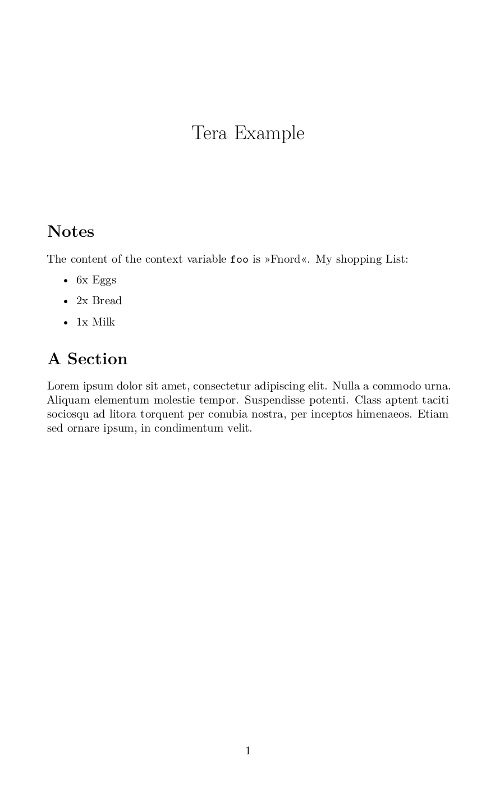

# rsmooth

Opinionated wrapper around [pandoc](https://pandoc.org) to convert [Markdown files](https://en.wikipedia.org/wiki/Markdown) into PDF's, office documents (odt, docx) and slide shows. The main idea of rsmooth is to define all the needed informations in the [Front Matter](https://jekyllrb.com/docs/front-matter/) (a [YAML](https://en.wikipedia.org/wiki/YAML) header within the markdown document) thus no external configuration is needed.

To allow for even more flexibility it's possible to run the content of your input file trough [Terra](https://tera.netlify.app/) (a templating language very similar to [Jinja2](https://jinja.palletsprojects.com/en/2.11.x/)). This allows you to tweak the content of your pandoc input. Currently rmsooth can convert markdown files into PDF's, OpenDocument Text (`.odt`), Office Open XML Document (`.docx`) and slide shows using [Reveal.js](https://revealjs.com/). Beside using pandocs default mechanism of creating PDF's, it's also possible to use [LibreOffice](https://www.libreoffice.org/).


## Installation

### Cargo

If you have [cargo installed](https://doc.rust-lang.org/cargo/getting-started/installation.html) simply call:

```shell script
cargo install rsmooth
``` 

### Binaries

You can download the binary in the [release section](https://github.com/72nd/rsmooth/releases/latest). Currently only the binary for Linux x86_64 is available (others should be follow shortly).


## Usage

This section will outline the most used work flows and options. Calling rsmooth with the `--help` flag will show all available functions.

### PDF Export

Take this simple file as a example (`example.md`):

```markdown

---
title: A Sample Document
author: John Doe
template: ~/templates/document.tex
---

Lorem ipsum dolor sit amet, consectetur adipiscing elit, sed do eiusmod tempor.
```

To create a PDF based on this file call:

```shellscript
rsmooth example.md
```

This will create `example.pdf`. If you want to specify another name of the PDF use the `-o` flag. The look of the resulting document is defined by the [pandoc template](https://pandoc.org/MANUAL.html#templates) specified by the `template` field in the YAML head. The path to the template file can either be relative or absolute; rsmooth also supports environment variables (like `$HOME`) and tildes as an abbreviation for the home path ([shell expansion](https://tldp.org/LDP/Bash-Beginners-Guide/html/sect_03_04.html)).


### Export to other formats

As stated above rsmooth also supports the creation of odt, docx documents and reveal.js slide shows. This can be tweaked by setting the `--format` (or `-f`) flag to one of the following values:

- **PDF** `--format pdf` Outputs a PDF. You can alter the engine used by setting the [engine](#pdf-engine) in the document header (hint: this currently defaults to `xelatex`).
- **ODT** `--format odt` Outputs the document as a [OpenDocument Text](https://en.wikipedia.org/wiki/OpenDocument) (commonly known as odt) office document. You can alter the appearance of the document by setting the [reference](#reference-file) in the document header. (Note: Currently the [template](#template) field is ignored when exporting to odt).
- **DOCX** `--format docx` Saves the document as a [Office Open XML Document](https://en.wikipedia.org/wiki/Office_Open_XML) (aka a docx). You can alter the appearance of the document by setting the [reference](#reference-file) in the document header.
- **ODT & PDF** `--format odtpdf` Will first export your document as a odt file and then using your LibreOffice installation converting this into a PDF. As with the other office-document based work flows you can use the [reference](#reference-file) field to alter the appearance of the result.
- **Reveal.js** `--format reveal` Using [reveal.js](https://revealjs.com/) rsmooth can export your document as a slide show. Don't forget to specify the path to the reveal.js assets with the `revealjs-url` field in your document header. 


### Apply the Tera template engine on input files

[Pandoc's template capabilities](https://pandoc.org/MANUAL.html#templates) gives you a lot of flexibility to control the output. But sometimes there is the need to have more control about the input side of things. This is why rsmooth allows you to alter the markdown input using the [Terra](https://tera.netlify.app/) template engine. You can enable Tera by setting the [do_tera](#apply-input-to-tera) and [tera_context](#tera-context) passing additional data (pleas read the documentation of the respective fields to learn more). You can learn more about the usage of Tera in [their documentation](https://tera.netlify.app/docs/#templates). Short example:

main.md: 

```jinja
---
title: Tera Example
do_tera: True
tera_context: 
	foo: Fnord
	shopping:
		- name: Eggs
		  amount: 6
		- name: Bread
		  amount: 2
		- name: Milk
		  amount: 1
---

# Notes

The content of the context variable `foo` is »{{ foo }}«. My shopping List:


- {{ item.amount}}x {{ item.name }}



``` 

section.md:

```markdown
# A Section

Lorem ipsum dolor sit amet, consectetur adipiscing elit. Nulla a commodo urna.
Aliquam elementum molestie tempor. Suspendisse potenti. Class aptent taciti
sociosqu ad litora torquent per conubia nostra, per inceptos himenaeos. Etiam
sed ornare ipsum, in condimentum velit.
```

Calling `rsmooth main.md` will produce the following pdf:

<p align="center">
  
</p>

### Example file

The application can create an example markdown file showcasing some of the functionality of rsmooth.

```shell script
rsmooth example-file -o example.md
```

Saves the content to the `example.md` file. Calling without the `-o` flag will output the example file to the STDOUT.


## Available document options

By using the YAML header (front matter) you can alter the behavior of rsmooth and use additional features.

Note: The whole content of the YAML header will be also available to pandoc and can thus be used in the template files using the `$VAR_NAME$` syntax.


### A word on paths

Rsmooth tries to resolve a variety of paths used in the configuration header. As they will get [shell expanded](https://tldp.org/LDP/Bash-Beginners-Guide/html/sect_03_04.html) you can use environment variables and tildes (`~`) for your home directory. Relative paths will be handled **relative to the input file's location**. Note: Only fields documented below support this path resolving mechanism.


### Template

**Field Name:** `template`

**Description:** Path to the template file. Learn more about these files in the [pandoc documentation](https://pandoc.org/MANUAL.html#templates). If no template is given the default template of pandoc will be used. The template field currently gets ignored when exporting documents as odt or docx.

**Type:** String (path).

**Default:** None.


### Reference File

**Field Name:** `reference`

**Description:** Path to a ODT or docx file as a style reference. Learn more in the [specific writer options](https://pandoc.org/MANUAL.html#options-affecting-specific-writers) on the `--reference-doc` option and it's usage.

**Type:** String (path).

**Default:** None.


### PDF Engine

**Field Name:** `engine`

**Description:** Name of the LaTeX engine used to create the PDF document. This internally will set the [--pdf-engine](https://pandoc.org/MANUAL.html#option--pdf-engine) option of pandoc.

**Type:** String.

**Default:** `xelatex` (as this is what I'm working with).


### Pandoc Options

**Field Name:** `pandoc_options`

**Description:** Feed [additional options](https://pandoc.org/MANUAL.html#options) into the pandoc call. Multiple arguments are expressed as a list of strings.

**Type:** String / List of Strings.

**Default:** None.


### Apply input to Tera

**Field Name:** `do_tera`

**Description:** States whether the markdown input should be passed trough the [Terra](https://tera.netlify.app/) template engine. This allows you some additional flexibility over your input which cannot be achieved by tweaking the pandoc template file. Especially useful to split the content of your document into multiple markdown files and including them using the `` syntax of Tera. You can pass information to Tera using the [Tera Context](#tera-context) field. You can learn more about the syntax of Tera in it's [Documentation](https://tera.netlify.app/docs/#templates).

**Type:** Boolean (`true`/`false`).

**Default:** `False`.


### Tera Context

**Field Name:** `tera_context`

**Description:** Sometimes it can be useful to pass some additional information to the Tera engine (context). This can be done by giving this field a map (dict) of strings to any type supported by YAML (learn more about maps in YAML [here](https://stackoverflow.com/a/34328811)).

**Type:** Map String to Any.

**Default:** None.


### Bibliography File

**Field Name:** `bibliography`

**Description:** Path to the file containing the bibliographic metadata used for citation within your document. [Pandoc supports](https://pandoc.org/MANUAL.html#specifying-bibliographic-data) BibLaTeX, BibTeX, CSL JSON and CSL YAML files. Learn more on how to use this functionality in the [pandoc documentation](https://pandoc.org/MANUAL.html#citation-syntax). Note: In order to use the citation functionality of pandoc `pandoc-citeproc` has to be installed on your system.

**Type:** String (path).

**Default:** None.


### Citation Style

**Field Name:** `csl`

**Description:** Path to the [Citation Style File](https://citationstyles.org/) describing the style of citations within the document.

**Type:** String (path).

**Default:** None (pandoc will use the Chicago Manual of Style author-date format).


## Environment Variables

rsmooth assumes the pandoc executable is callable with the `pandoc` command. You can use the environment variable `PANDOC_CMD` to alter this.

The location of LibreOffice defaults to `soffice` and can be changed using the `LIBREOFFICE_CMD` environment variable.
